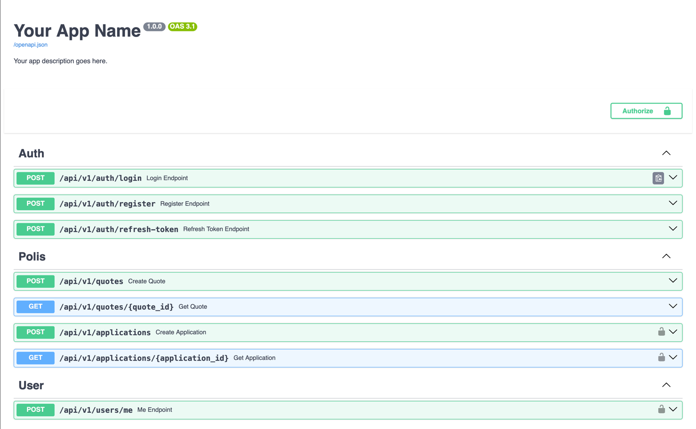

# Polis Calculation Project Setup Guide


### Example Image




## 1. Clone the repository

```bash
git clone https://github.com/azizjon-aliev/polis-calc.git
cd polis-calc
```

## 2. Environment variables

```bash
cp .env.example .env
# Edit the .env file to configure your environment (DB credentials, secret keys, etc.)
```

## 3. Running with Docker

**Requirements:**

* [Docker](https://docs.docker.com/)
* [Docker Compose](https://docs.docker.com/compose/)

```bash
docker compose up --build
```

Then open your browser:

[Project Swagger Docs](http://0.0.0.0:8000/docs)

## 4. Running without Docker

**Requirements:**

* [Python 3.13](https://www.python.org/downloads/release/python-3130/)
* [PostgreSQL](https://www.postgresql.org/docs/)
* [Redis](https://redis.io/docs/latest/)
* [uv package](https://docs.astral.sh/uv/)

```bash
# Create virtual environment
uv venv
source .venv/bin/activate  # Linux/macOS
# or .venv\Scripts\activate  # Windows

# Install requirements
uv sync

# Run migrations if any (Alembic)
uv run alembic upgrade head

# Start the app
uv run uvicorn app.main:app --reload
```

Then open your browser:

[Project Swagger Docs](http://127.0.0.1:8000/docs)


