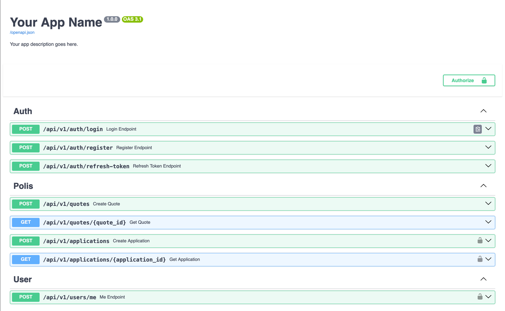
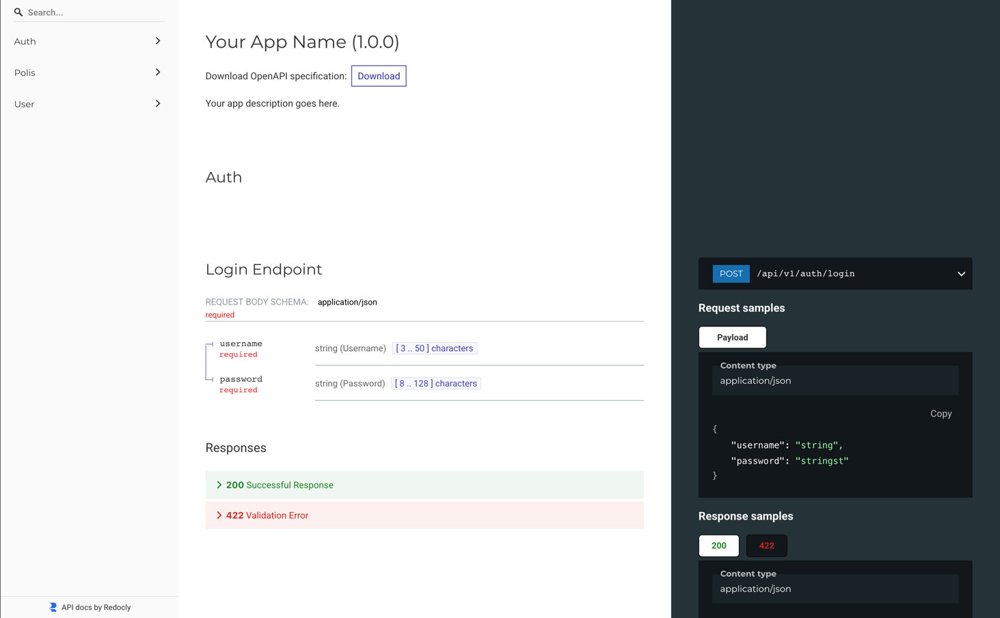

# Polis Calculation Project — Setup Guide (compact)

### Example docs

  



---

## Quick start

1. **Clone**

```bash
git clone https://github.com/azizjon-aliev/polis-calc.git && cd polis-calc
```

2. **Env**

```bash
cp .env.example .env
# edit .env (DB, secrets, etc.)
```

3. **With Docker**

```bash
docker compose up --build
# open http://0.0.0.0:8000/docs or /redoc
```

4. **Without Docker (dev)**

```bash
# create venv (using uv tool in this repo)
uv venv; source .venv/bin/activate
uv sync           # install deps
uv run alembic upgrade head
uv run uvicorn app.main:app --reload
```

---

## API surface (short)

* **Auth**

  * `POST /auth/register` — register (returns JWT)
  * `POST /auth/login` — login (returns access & refresh JWT)
* **Quotes**

  * `POST /quotes` — calculate a quote (body: tariff, age, experience, car\_type) — returns price + saved quote
  * `GET /quotes/{id}` — get quote by id
* **Applications**

  * `POST /applications` — create application (name, phone, email, tariff, quote\_id)
  * `GET /applications/{id}` — view application (authenticated user)

Other: unified error format, input validation on all endpoints.

---

## DB & infra

* Migrations with Alembic; add key indexes for lookup fields (quote id, user\_id, created\_at).
* Swagger/OpenAPI enabled; basic security headers + CORS configured.
* Optional: `docker compose up` brings API + PostgreSQL. Logging + simple request counter included.

---

## Quote calculation — coefficients (compact)

**Tariff**

* `standard` → `1.0`
* `premium`  → `1.5`

**Age**

* `age < 25` → `1.2`
* `25 ≤ age ≤ 60` → `1.0`
* `age > 60` → `1.1`

**Driving experience**

* `< 2 years` → `1.3`
* `2–4 years` → `1.1`
* `≥ 5 years` → `1.0`

**Car type**

* `sedan` → `1.0`
* `suv`   → `1.2`
* `truck` → `1.3`

**Formula**

```
final_price = base_price
            * tariff_coeff
            * age_coeff(age)
            * experience_coeff(experience)
            * car_type_coeff
```

Round with:

```py
Decimal.quantize(Decimal("0.01"), rounding=ROUND_HALF_UP)
```

**Notes**

* `settings.quote_base_price` must be `Decimal`. Use Decimal end-to-end and serialize to string in JSON if needed.
* Coefficients are static by default — move to config/DB if you need runtime changes.
* Validate `age` and `experience` as positive integers in schemas.

---

If you want this in Russian, or even shorter (single-paragraph), say the word and I’ll shrink it.
